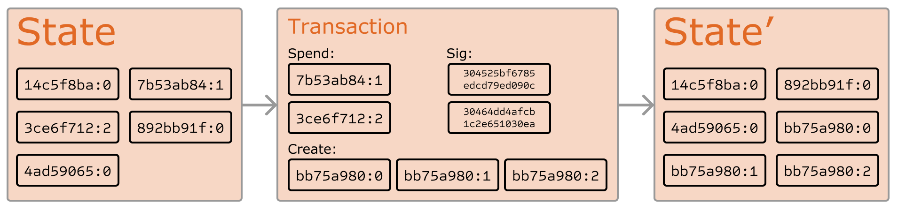
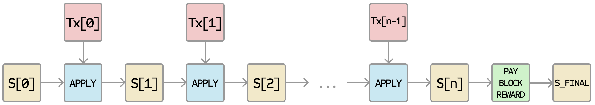

# Terminos Whitepaper

## Abstract

The aim of this text is to provide a first description of the terminos and related blockchain, peer-to-peer, distributed storage and service hosting technologies. To reduce the size of this document to reasonable proportions, we focus mainly on the unique and defining features of the TOS platform that are important for it to achieve its stated goals.

## Introduction

Terminos is a fast, secure and scalable blockchain and network project, capable of handling millions of transactions per second if necessary, and both user-friendly and service provider-friendly. We aim for it to be able to host all reasonable applications currently proposed and conceived. One might think about terminos as a huge distributed super computer, intended to host and provide a variety of services. This text is not intended to be the ultimate reference with respect to all implementation details. Some particulars are likely to change during the development and testing phases.

- The terminos natively integrates and internally uses the solidity or java language for fast and secure transaction execution. The prover, a formal verifier for smart contracts written in the solidity or java language, provides additional safeguards for contract invariants and behavior. This focus on security allows developers to better protect their software from malicious entities.

- The terminos data model enables flexible key management and hybrid custodial options. This, alongside transaction transparency prior to signing and practical light client protocols, provides a safer and more trustworthy user experience.

- The terminos modular architecture design supports client flexibility and optimizes for frequent and instant upgrades. Moreover, to rapidly deploy new technology innovations and support new web3 use cases, the terminos blockchain provides signing smart contracts files change management protocols.

- Gas Free, Forever. terminos is a limitlessly scalable, fast, on-demand blockchain network with gas free, allowing quick deployment of interoperable EVM-compatible chains without compromising security or decentralization.

Terminos is a fully decentralized, open-source, community-owned network.


### Terminos Accounts

In the terminos blockchain, the state is made up of objects called "accounts", with each account having a 20-byte address and state transitions being direct transfers of value and information between accounts. 

In general, there are two types of accounts: externally owned accounts, controlled by private keys and multi-signer keys, and contract accounts, controlled by their contract code. An externally owned account has no code, and one can send messages from an externally owned account by creating and signing a transaction; in a contract account, every time the contract account receives a message its code activates, allowing it to read and write to internal storage.

A terminos account contains next fields:

- balance, The account's current terminos balance
- nonce, A counter used to make sure each transaction can only be processed once
- codeHash, This hash refers to the code of an account on the tos virtual machine. For externally owned accounts, empty string.
- storage, The account's storage (empty by default)

Miner fees such as BTC and Ether are required when you initiate transactions on Bitcoin and Ethereum networks, however, when you transfer funds on tos network, terminos fees are consumed. 

### Key differences

**Externally-owned**

- Creating an account has no cost
- Can initiate transactions
- Transactions between externally-owned accounts can only be terminos Coin transfers
- Made up of a cryptographic pair of keys: public and private keys that control account activities

**Contract**

- Creating a contract has a cost because you're using layer 2 DHT(Distributed hash table) network storage
- Contract code is storaged in the layer 2 DHT(Distributed hash table) network storage
- Contract accounts don't have private keys. Instead, they are controlled by the logic of the smart contract code

## Externally-owned accounts and key pairs

An account is made up of a cryptographic pair of keys: public and private. They help prove that a transaction was actually signed by the sender and prevent forgeries. Your private key is what you use to sign transactions, so it grants you custody over the funds associated with your account. You never really hold cryptocurrency, you hold private keys – the funds are always on terminos's ledger. When msigner is not empty, it should require multiple signatures for signing a transaction.

This prevents malicious actors from broadcasting fake transactions because you can always verify the sender of a transaction.

If Alice wants to send ether from her own account to Bob’s account, Alice needs to create a transaction request and send it out to the network for verification. terminos’s usage of public-key cryptography ensures that Alice can prove that she originally initiated the transaction request. Without cryptographic mechanisms, a malicious adversary Eve could simply publicly broadcast a request that looks something like “send 5 terminos from Alice’s account to Eve’s account,” and no one would be able to verify that it didn’t come from Alice.

### Messages and Transactions

The term "transaction" is used in terminos blockchain to refer to the signed data package that stores a message to be sent from an externally owned account. Transactions contain:

- nonce, A counter used to make sure each transaction can only be processed once
- from, The address of sender 
- to, The address of recipient
- value, The amount of Coin to transfer from the sender to the recipient
- message, An optional message to the recipient
- chainid, The ID of blockchain
- 0x0, fixed value
- 0x0, fixed value
- A signature identifying the sender
- A signature identifying the multi-signer

### Terminos State Transition Function



The terminos state transition function, `APPLY(S,TX) -> S'` can be defined as follows:

1. Check if the transaction is well-formed (ie. has the right number of values), the signature is valid, and the nonce matches the nonce in the sender's account. If not, return an error.
2. Transfer the transaction value from the sender's account to the receiving account. If the receiving account does not yet exist, return an error. If the receiving account is a contract, run the contract's code either to completion or until the execution runs out of gas.
3. If the value transfer failed because the sender did not have enough money, revert all state changes except the payment of the fees.
4. Send the fees paid for gas consumed to the miner.

For example, suppose that the contract's code is:

```py
if !self.storage[calldataload(0)]:
  self.storage[calldataload(0)] = calldataload(32)
```

Note that in reality the contract code is written in the low-level EVM code; this example is written in Serpent, one of our high-level languages, for clarity, and can be compiled down to EVM code. Suppose that the contract's storage starts off empty, and a transaction is sent with 10 tos value, 2000 gas, 0.001 tos gasprice, and 64 bytes of data, with bytes 0-31 representing the number `2` and bytes 32-63 representing the string `CHARLIE`. The process for the state transition function in this case is as follows:

1. Check that the transaction is valid and well formed.
2. Check that the transaction sender has at least 2000 \* 0.001 = 2 tos. If it is, then subtract 2 tos from the sender's account.
3. Initialize gas = 2000; assuming the transaction is 170 bytes long and the byte-fee is 5, subtract 850 so that there is 1150 gas left.
4. Subtract 10 more tos from the sender's account, and add it to the contract's account.
5. Run the code. In this case, this is simple: it checks if the contract's storage at index `2` is used, notices that it is not, and so it sets the storage at index `2` to the value `CHARLIE`. Suppose this takes 187 gas, so the remaining amount of gas is 1150 - 187 = 963
6. Add 963 \* 0.001 = 0.963 tos back to the sender's account, and return the resulting state.

If there was no contract at the receiving end of the transaction, then the total transaction fee would simply be equal to the provided `GASPRICE` multiplied by the length of the transaction in bytes, and the data sent alongside the transaction would be irrelevant.

Note that messages work equivalently to transactions in terms of reverts: if a message execution runs out of gas, then that message's execution, and all other executions triggered by that execution, revert, but parent executions do not need to revert. This means that it is "safe" for a contract to call another contract, as if A calls B with G gas then A's execution is guaranteed to lose at most G gas. Finally, note that there is an opcode, `CREATE`, that creates a contract; its execution mechanics are generally similar to `CALL`, with the exception that the output of the execution determines the code of a newly created contract.

### Code Execution

The code in terminos contracts is written in a low-level, stack-based bytecode language, referred to as "terminos virtual machine code" or "TVM code". The code consists of a series of bytes, where each byte represents an operation. In general, code execution is an infinite loop that consists of repeatedly carrying out the operation at the current program counter (which begins at zero) and then incrementing the program counter by one, until the end of the code is reached or an error or `STOP` or `RETURN` instruction is detected. The operations have access to three types of space in which to store data:

- The **stack**, a last-in-first-out container to which values can be pushed and popped
- **Memory**, an infinitely expandable byte array
- The contract's long-term **storage**, a key/value store. Unlike stack and memory, which reset after computation ends, storage persists for the long term.

The code can also access the value, sender and data of the incoming message, as well as block header data, and the code can also return a byte array of data as an output.

The formal execution model of EVM code is surprisingly simple. While the Tos virtual machine is running, its full computational state can be defined by the tuple `(block_state, transaction, message, code, memory, stack, pc, gas)`, where `block_state` is the global state containing all accounts and includes balances and storage. At the start of every round of execution, the current instruction is found by taking the `pc`th byte of `code` (or 0 if `pc >= len(code)`), and each instruction has its own definition in terms of how it affects the tuple. For example, `ADD` pops two items off the stack and pushes their sum, reduces `gas` by 1 and increments `pc` by 1, and `SSTORE` pops the top two items off the stack and inserts the second item into the contract's storage at the index specified by the first item. Although there are many ways to optimize Tos virtual machine execution via just-in-time compilation, a basic implementation of Tos can be done in a few hundred lines of code.

### Blockchain and Mining



The terminos blockchain is in many ways similar to the Bitcoin blockchain, although it does have some differences. The main difference between terminos and Bitcoin with regard to the blockchain architecture is that, unlike Bitcoin, terminos blocks contain a copy of both the transaction list and the most recent state. Aside from that, two other values, the block number and the difficulty, are also stored in the block. The basic block validation algorithm in terminos is as follows:

1. Check if the previous block referenced exists and is valid.
2. Check that the timestamp of the block is greater than that of the referenced previous block and less than 15 minutes into the future
3. Check that the block number, difficulty, transaction root, uncle root and gas limit (various low-level terminos-specific concepts) are valid.
4. Check that the proof-of-work on the block is valid.
5. Let `S[0]` be the state at the end of the previous block.
6. Let `TX` be the block's transaction list, with `n` transactions. For all `i` in `0...n-1`, set `S[i+1] = APPLY(S[i],TX[i])`. If any applications returns an error, or if the total gas consumed in the block up until this point exceeds the `GASLIMIT`, return an error.
7. Let `S_FINAL` be `S[n]`, but adding the block reward paid to the miner.
8. Check if the Merkle tree root of the state `S_FINAL` is equal to the final state root provided in the block header. If it is, the block is valid; otherwise, it is not valid.

The approach may seem highly inefficient at first glance, because it needs to store the entire state with each block, but in reality efficiency should be comparable to that of Bitcoin. The reason is that the state is stored in the tree structure, and after every block only a small part of the tree needs to be changed. Thus, in general, between two adjacent blocks the vast majority of the tree should be the same, and therefore the data can be stored once and referenced twice using pointers (ie. hashes of subtrees). A special kind of tree known as a "Patricia tree" is used to accomplish this, including a modification to the Merkle tree concept that allows for nodes to be inserted and deleted, and not just changed, efficiently. Additionally, because all of the state information is part of the last block, there is no need to store the entire blockchain history - a strategy which, if it could be applied to Bitcoin, can be calculated to provide 5-20x savings in space.

A commonly asked question is "where" contract code is executed, in terms of physical hardware. This has a simple answer: the process of executing contract code is part of the definition of the state transition function, which is part of the block validation algorithm, so if a transaction is added into block `B` the code execution spawned by that transaction will be executed by all nodes, now and in the future, that download and validate block `B`.

### Mobile Mining


## Applications

In general, there are three types of applications on top of terminos. The first category is financial applications, providing users with more powerful ways of managing and entering into contracts using their money. This includes sub-currencies, financial derivatives, hedging contracts, savings wallets, wills, and ultimately even some classes of full-scale employment contracts. The second category is semi-financial applications, where money is involved but there is also a heavy non-monetary side to what is being done; a perfect example is self-enforcing bounties for solutions to computational problems. Finally, there are applications such as online voting and decentralized governance that are not financial at all.

### Token Systems

On-blockchain token systems have many applications ranging from sub-currencies representing assets such as USD or gold to company stocks, individual tokens representing smart property, secure unforgeable coupons, and even token systems with no ties to conventional value at all, used as point systems for incentivization. Token systems are surprisingly easy to implement in terminos. The key point to understand is that all a currency, or token system, fundamentally is, is a database with one operation: subtract X units from A and give X units to B, with the proviso that (i) A had at least X units before the transaction and (2) the transaction is approved by A. All that it takes to implement a token system is to implement this logic into a contract.

The basic code for implementing a token system in Serpent looks as follows:

```py
def send(to, value):
  if self.storage[msg.sender] >= value:
    self.storage[msg.sender] = self.storage[msg.sender] - value
    self.storage[to] = self.storage[to] + value
```

This is essentially a literal implementation of the "banking system" state transition function described further above in this document. A few extra lines of code need to be added to provide for the initial step of distributing the currency units in the first place and a few other edge cases, and ideally a function would be added to let other contracts query for the balance of an address. But that's all there is to it. Theoretically, terminos-based token systems acting as sub-currencies can potentially include another important feature that on-chain Bitcoin-based meta-currencies lack: the ability to pay transaction fees directly in that currency. The way this would be implemented is that the contract would maintain an tos balance with which it would refund tos used to pay fees to the sender, and it would refill this balance by collecting the internal currency units that it takes in fees and reselling them in a constant running auction. Users would thus need to "activate" their accounts with tos, but once the tos is there it would be reusable because the contract would refund it each time.

### Financial derivatives and Stable-Value Currencies

Financial derivatives are the most common application of a "smart contract", and one of the simplest to implement in code. The main challenge in implementing financial contracts is that the majority of them require reference to an external price ticker; for example, a very desirable application is a smart contract that hedges against the volatility of tos (or another cryptocurrency) with respect to the US dollar, but doing this requires the contract to know what the value of ETH/USD is. The simplest way to do this is through a "data feed" contract maintained by a specific party (eg. NASDAQ) designed so that that party has the ability to update the contract as needed, and providing an interface that allows other contracts to send a message to that contract and get back a response that provides the price.

Given that critical ingredient, the hedging contract would look as follows:

1. Wait for party A to input 1000 tos.
2. Wait for party B to input 1000 tos.
3. Record the USD value of 1000 tos, calculated by querying the data feed contract, in storage, say this is $x.
4. After 30 days, allow A or B to "reactivate" the contract in order to send $x worth of tos (calculated by querying the data feed contract again to get the new price) to A and the rest to B.

Such a contract would have significant potential in crypto-commerce. One of the main problems cited about cryptocurrency is the fact that it's volatile; although many users and merchants may want the security and convenience of dealing with cryptographic assets, they many not wish to face that prospect of losing 23% of the value of their funds in a single day. Up until now, the most commonly proposed solution has been issuer-backed assets; the idea is that an issuer creates a sub-currency in which they have the right to issue and revoke units, and provide one unit of the currency to anyone who provides them (offline) with one unit of a specified underlying asset (eg. gold, USD). The issuer then promises to provide one unit of the underlying asset to anyone who sends back one unit of the crypto-asset. This mechanism allows any non-cryptographic asset to be "uplifted" into a cryptographic asset, provided that the issuer can be trusted.

In practice, however, issuers are not always trustworthy, and in some cases the banking infrastructure is too weak, or too hostile, for such services to exist. Financial derivatives provide an alternative. Here, instead of a single issuer providing the funds to back up an asset, a decentralized market of speculators, betting that the price of a cryptographic reference asset (eg. ETH) will go up, plays that role. Unlike issuers, speculators have no option to default on their side of the bargain because the hedging contract holds their funds in escrow. Note that this approach is not fully decentralized, because a trusted source is still needed to provide the price ticker, although arguably even still this is a massive improvement in terms of reducing infrastructure requirements (unlike being an issuer, issuing a price feed requires no licenses and can likely be categorized as free speech) and reducing the potential for fraud.

### Identity and Reputation Systems

The earliest alternative cryptocurrency of all, [Namecoin](http://namecoin.org/), attempted to use a Bitcoin-like blockchain to provide a name registration system, where users can register their names in a public database alongside other data. The major cited use case is for a [DNS](https://wikipedia.org/wiki/Domain_Name_System) system, mapping domain names like "bitcoin.org" (or, in Namecoin's case, "bitcoin.bit") to an IP address. Other use cases include email authentication and potentially more advanced reputation systems. Here is the basic contract to provide a Namecoin-like name registration system on terminos:

```py
def register(name, value):
  if !self.storage[name]:
    self.storage[name] = value
```

The contract is very simple; all it is is a database inside the terminos network that can be added to, but not modified or removed from. Anyone can register a name with some value, and that registration then sticks forever. A more sophisticated name registration contract will also have a "function clause" allowing other contracts to query it, as well as a mechanism for the "owner" (ie. the first registerer) of a name to change the data or transfer ownership. One can even add reputation and web-of-trust functionality on top.

### Decentralized File Storage

Over the past few years, there have emerged a number of popular online file storage startups, the most prominent being Dropbox, seeking to allow users to upload a backup of their hard drive and have the service store the backup and allow the user to access it in exchange for a monthly fee. However, at this point the file storage market is at times relatively inefficient; a cursory look at various existing solutions shows that, particularly at the "uncanny valley" 20-200 GB level at which neither free quotas nor enterprise-level discounts kick in, monthly prices for mainstream file storage costs are such that you are paying for more than the cost of the entire hard drive in a single month. terminos contracts can allow for the development of a decentralized file storage ecosystem, where individual users can earn small quantities of money by renting out their own hard drives and unused space can be used to further drive down the costs of file storage.

The key underpinning piece of such a device would be what we have termed the "decentralized Dropbox contract". This contract works as follows. First, one splits the desired data up into blocks, encrypting each block for privacy, and builds a Merkle tree out of it. One then makes a contract with the rule that, every N blocks, the contract would pick a random index in the Merkle tree (using the previous block hash, accessible from contract code, as a source of randomness), and give X tos to the first entity to supply a transaction with a simplified payment verification-like proof of ownership of the block at that particular index in the tree. When a user wants to re-download their file, they can use a micropayment channel protocol (eg. pay 1 szabo per 32 kilobytes) to recover the file; the most fee-efficient approach is for the payer not to publish the transaction until the end, instead replacing the transaction with a slightly more lucrative one with the same nonce after every 32 kilobytes.

An important feature of the protocol is that, although it may seem like one is trusting many random nodes not to decide to forget the file, one can reduce that risk down to near-zero by splitting the file into many pieces via secret sharing, and watching the contracts to see each piece is still in some node's possession. If a contract is still paying out money, that provides a cryptographic proof that someone out there is still storing the file.

### Decentralized Autonomous Organizations

The general concept of a "decentralized autonomous organization" is that of a virtual entity that has a certain set of members or shareholders which, perhaps with a 67% majority, have the right to spend the entity's funds and modify its code. The members would collectively decide on how the organization should allocate its funds. Methods for allocating a DAO's funds could range from bounties, salaries to even more exotic mechanisms such as an internal currency to reward work. This essentially replicates the legal trappings of a traditional company or nonprofit but using only cryptographic blockchain technology for enforcement. So far much of the talk around DAOs has been around the "capitalist" model of a "decentralized autonomous corporation" (DAC) with dividend-receiving shareholders and tradable shares; an alternative, perhaps described as a "decentralized autonomous community", would have all members have an equal share in the decision making and require 67% of existing members to agree to add or remove a member. The requirement that one person can only have one membership would then need to be enforced collectively by the group.

A general outline for how to code a DAO is as follows. The simplest design is simply a piece of self-modifying code that changes if two thirds of members agree on a change. Although code is theoretically immutable, one can easily get around this and have de-facto mutability by having chunks of the code in separate contracts, and having the address of which contracts to call stored in the modifiable storage. In a simple implementation of such a DAO contract, there would be three transaction types, distinguished by the data provided in the transaction:

- `[0,i,K,V]` to register a proposal with index `i` to change the address at storage index `K` to value `V`
- `[1,i]` to register a vote in favor of proposal `i`
- `[2,i]` to finalize proposal `i` if enough votes have been made

The contract would then have clauses for each of these. It would maintain a record of all open storage changes, along with a list of who voted for them. It would also have a list of all members. When any storage change gets to two thirds of members voting for it, a finalizing transaction could execute the change. A more sophisticated skeleton would also have built-in voting ability for features like sending a transaction, adding members and removing members, and may even provide for [Liquid Democracy](https://wikipedia.org/wiki/Liquid_democracy)-style vote delegation (ie. anyone can assign someone to vote for them, and assignment is transitive so if A assigns B and B assigns C then C determines A's vote). This design would allow the DAO to grow organically as a decentralized community, allowing people to eventually delegate the task of filtering out who is a member to specialists, although unlike in the "current system" specialists can easily pop in and out of existence over time as individual community members change their alignments.

An alternative model is for a decentralized corporation, where any account can have zero or more shares, and two thirds of the shares are required to make a decision. A complete skeleton would involve asset management functionality, the ability to make an offer to buy or sell shares, and the ability to accept offers (preferably with an order-matching mechanism inside the contract). Delegation would also exist Liquid Democracy-style, generalizing the concept of a "board of directors".

### Modified GHOST Implementation

The "Greedy Heaviest Observed Subtree" (GHOST) protocol is an innovation first introduced by Yonatan Sompolinsky and Aviv Zohar in [December 2013](https://eprint.iacr.org/2013/881.pdf). The motivation behind GHOST is that blockchains with fast confirmation times currently suffer from reduced security due to a high stale rate - because blocks take a certain time to propagate through the network, if miner A mines a block and then miner B happens to mine another block before miner A's block propagates to B, miner B's block will end up wasted and will not contribute to network security. Furthermore, there is a centralization issue: if miner A is a mining pool with 30% hashpower and B has 10% hashpower, A will have a risk of producing a stale block 70% of the time (since the other 30% of the time A produced the last block and so will get mining data immediately) whereas B will have a risk of producing a stale block 90% of the time. Thus, if the block interval is short enough for the stale rate to be high, A will be substantially more efficient simply by virtue of its size. With these two effects combined, blockchains which produce blocks quickly are very likely to lead to one mining pool having a large enough percentage of the network hashpower to have de facto control over the mining process.

As described by Sompolinsky and Zohar, GHOST solves the first issue of network security loss by including stale blocks in the calculation of which chain is the "longest"; that is to say, not just the parent and further ancestors of a block, but also the stale descendants of the block's ancestor (in terminos jargon, "uncles") are added to the calculation of which block has the largest total proof-of-work backing it. To solve the second issue of centralization bias, we go beyond the protocol described by Sompolinsky and Zohar, and also provide block rewards to stales: a stale block receives 87.5% of its base reward, and the nephew that includes the stale block receives the remaining 12.5%. Transaction fees, however, are not awarded to uncles.

Terminos implements a simplified version of GHOST which only goes down seven levels. Specifically, it is defined as follows:

- A block must specify a parent, and it must specify 0 or more uncles
- An uncle included in block B must have the following properties:
  - It must be a direct child of the kth generation ancestor of B, where 2 <= k <= 7.
  - It cannot be an ancestor of B
  - An uncle must be a valid block header, but does not need to be a previously verified or even valid block
  - An uncle must be different from all uncles included in previous blocks and all other uncles included in the same block (non-double-inclusion)
- For every uncle U in block B, the miner of B gets an additional 3.125% added to its coinbase reward and the miner of U gets 93.75% of a standard coinbase reward.

This limited version of GHOST, with uncles includable only up to 7 generations, was used for two reasons. First, unlimited GHOST would include too many complications into the calculation of which uncles for a given block are valid. Second, unlimited GHOST with compensation as used in terminos removes the incentive for a miner to mine on the main chain and not the chain of a public attacker.

### Fees

Because every transaction published into the blockchain imposes on the network the cost of needing to download and verify it, there is a need for some regulatory mechanism, typically involving transaction fees, to prevent abuse. The default approach, used in Bitcoin, is to have purely voluntary fees, relying on miners to act as the gatekeepers and set dynamic minimums. This approach has been received very favorably in the Bitcoin community particularly because it is "market-based", allowing supply and demand between miners and transaction senders determine the price. The problem with this line of reasoning is, however, that transaction processing is not a market; although it is intuitively attractive to construe transaction processing as a service that the miner is offering to the sender, in reality every transaction that a miner includes will need to be processed by every node in the network, so the vast majority of the cost of transaction processing is borne by third parties and not the miner that is making the decision of whether or not to include it. Hence, tragedy-of-the-commons problems are very likely to occur.

However, as it turns out this flaw in the market-based mechanism, when given a particular inaccurate simplifying assumption, magically cancels itself out. The argument is as follows. Suppose that:

1. A transaction leads to `k` operations, offering the reward `kR` to any miner that includes it where `R` is set by the sender and `k` and `R` are (roughly) visible to the miner beforehand.
2. An operation has a processing cost of `C` to any node (ie. all nodes have equal efficiency)
3. There are `N` mining nodes, each with exactly equal processing power (ie. `1/N` of total)
4. No non-mining full nodes exist.

A miner would be willing to process a transaction if the expected reward is greater than the cost. Thus, the expected reward is `kR/N` since the miner has a `1/N` chance of processing the next block, and the processing cost for the miner is simply `kC`. Hence, miners will include transactions where `kR/N > kC`, or `R > NC`. Note that `R` is the per-operation fee provided by the sender, and is thus a lower bound on the benefit that the sender derives from the transaction, and `NC` is the cost to the entire network together of processing an operation. Hence, miners have the incentive to include only those transactions for which the total utilitarian benefit exceeds the cost.

However, there are several important deviations from those assumptions in reality:

1. The miner does pay a higher cost to process the transaction than the other verifying nodes, since the extra verification time delays block propagation and thus increases the chance the block will become a stale.
2. There do exist nonmining full nodes.
3. The mining power distribution may end up radically inegalitarian in practice.
4. Speculators, political enemies and crazies whose utility function includes causing harm to the network do exist, and they can cleverly set up contracts where their cost is much lower than the cost paid by other verifying nodes.

(1) provides a tendency for the miner to include fewer transactions, and
(2) increases `NC`; hence, these two effects at least partially
cancel each other
out.<sup>[How?](https://github.com/tos/wiki/issues/447#issuecomment-316972260)</sup>
(3) and (4) are the major issue; to solve them we simply institute a
floating cap: no block can have more operations than
`BLK_LIMIT_FACTOR` times the long-term exponential moving average.
Specifically:

```js
blk.oplimit = floor((blk.parent.oplimit \* (EMAFACTOR - 1) +
floor(parent.opcount \* BLK\_LIMIT\_FACTOR)) / EMA\_FACTOR)
```

`BLK_LIMIT_FACTOR` and `EMA_FACTOR` are constants that will be set to 65536 and 1.5 for the time being, but will likely be changed after further analysis.

There is another factor disincentivizing large block sizes in Bitcoin: blocks that are large will take longer to propagate, and thus have a higher probability of becoming stales. In terminos, highly gas-consuming blocks can also take longer to propagate both because they are physically larger and because they take longer to process the transaction state transitions to validate. This delay disincentive is a significant consideration in Bitcoin, but less so in terminos because of the GHOST protocol; hence, relying on regulated block limits provides a more stable baseline.

### Computation And Turing-Completeness

An important note is that the terminos virtual machine is Turing-complete; this means that EVM code can encode any computation that can be conceivably carried out, including infinite loops. EVM code allows looping in two ways. First, there is a `JUMP` instruction that allows the program to jump back to a previous spot in the code, and a `JUMPI` instruction to do conditional jumping, allowing for statements like `while x < 27: x = x * 2`. Second, contracts can call other contracts, potentially allowing for looping through recursion. This naturally leads to a problem: can malicious users essentially shut miners and full nodes down by forcing them to enter into an infinite loop? The issue arises because of a problem in computer science known as the halting problem: there is no way to tell, in the general case, whether or not a given program will ever halt.

As described in the state transition section, our solution works by requiring a transaction to set a maximum number of computational steps that it is allowed to take, and if execution takes longer computation is reverted but fees are still paid. Messages work in the same way. To show the motivation behind our solution, consider the following examples:

- An attacker creates a contract which runs an infinite loop, and then sends a transaction activating that loop to the miner. The miner will process the transaction, running the infinite loop, and wait for it to run out of gas. Even though the execution runs out of gas and stops halfway through, the transaction is still valid and the miner still claims the fee from the attacker for each computational step.
- An attacker creates a very long infinite loop with the intent of forcing the miner to keep computing for such a long time that by the time computation finishes a few more blocks will have come out and it will not be possible for the miner to include the transaction to claim the fee. However, the attacker will be required to submit a value for `STARTGAS` limiting the number of computational steps that execution can take, so the miner will know ahead of time that the computation will take an excessively large number of steps.
- An attacker sees a contract with code of some form like `send(A,contract.storage[A]); contract.storage[A] = 0`, and sends a transaction with just enough gas to run the first step but not the second (ie. making a withdrawal but not letting the balance go down). The contract author does not need to worry about protecting against such attacks, because if execution stops halfway through the changes get reverted.
- A financial contract works by taking the median of nine proprietary data feeds in order to minimize risk. An attacker takes over one of the data feeds, which is designed to be modifiable via the variable-address-call mechanism described in the section on DAOs, and converts it to run an infinite loop, thereby attempting to force any attempts to claim funds from the financial contract to run out of gas. However, the financial contract can set a gas limit on the message to prevent this problem.

The alternative to Turing-completeness is Turing-incompleteness, where `JUMP` and `JUMPI` do not exist and only one copy of each contract is allowed to exist in the call stack at any given time. With this system, the fee system described and the uncertainties around the effectiveness of our solution might not be necessary, as the cost of executing a contract would be bounded above by its size. Additionally, Turing-incompleteness is not even that big a limitation; out of all the contract examples we have conceived internally, so far only one required a loop, and even that loop could be removed by making 26 repetitions of a one-line piece of code. Given the serious implications of Turing-completeness, and the limited benefit, why not simply have a Turing-incomplete language? In reality, however, Turing-incompleteness is far from a neat solution to the problem. To see why, consider the following contracts:

```sh
C0: call(C1); call(C1);
C1: call(C2); call(C2);
C2: call(C3); call(C3);
...
C49: call(C50); call(C50);
C50: (run one step of a program and record the change in storage)
```

Now, send a transaction to A. Thus, in 51 transactions, we have a contract that takes up 2<sup>50</sup> computational steps. Miners could try to detect such logic bombs ahead of time by maintaining a value alongside each contract specifying the maximum number of computational steps that it can take, and calculating this for contracts calling other contracts recursively, but that would require miners to forbid contracts that create other contracts (since the creation and execution of all 26 contracts above could easily be rolled into a single contract). Another problematic point is that the address field of a message is a variable, so in general it may not even be possible to tell which other contracts a given contract will call ahead of time. Hence, all in all, we have a surprising conclusion: Turing-completeness is surprisingly easy to manage, and the lack of Turing-completeness is equally surprisingly difficult to manage unless the exact same controls are in place - but in that case why not just let the protocol be Turing-complete?

### Currency And Issuance 

The terminos network includes its own built-in currency, tos, which serves the dual purpose of providing a primary liquidity layer to allow for efficient exchange between various types of digital assets and, more importantly, of providing a GAS mechanism for paying transaction fees on the tos network. 

Each terminos account receives 600B GAS per T + 1 day for free, and there are two methods to obtain more GAS if you want.(Note: 1KB = 1024 B, so 600 B = 600/1024 KB ≈ 0.58 KB.)

Method 1: Burn terminos (recommended) 
Transfer 50-100 terminos into your terminos wallet and when making transactions, a small amount of terminos will be burned to provide the GAS required for the transaction.

Method 2: Freeze terminos 
Hold your terminos in your terminos wallet and you will get GAS = terminos*5%*days/365 per T + 3 day for free. 

### Decentralized Mining

Terminos Coin can be mined with Arduinos, ESP8266/32 boards, Raspberry Pis, computers, and many more IoTs including Wi-Fi routers, smart TVs, smartphones, smartwatches, SBCs, MCUs or even GPUs.

## Conclusion 

The tos network protocol was originally conceived as an upgraded version of a cryptocurrency, providing advanced features such as on-blockchain escrow, withdrawal limits, financial contracts, gambling markets and the like via a highly generalized programming language. The tos network protocol would not "support" any of the applications directly, but the existence of a Turing-complete programming language means that arbitrary contracts can theoretically be created for any transaction type or application. What is more interesting about terminos, however, is that the terminos protocol moves far beyond just currency. Protocols around decentralized file storage, decentralized computation and decentralized prediction markets, among dozens of other such concepts, have the potential to substantially increase the efficiency of the computational industry, and provide a massive boost to other peer-to-peer protocols by adding for the first time an economic layer. Finally, there is also a substantial array of applications that have nothing to do with money at all.

The concept of an arbitrary state transition function as implemented by the terminos protocol provides for a platform with unique potential; rather than being a closed-ended, single-purpose protocol intended for a specific array of applications in data storage, gambling or finance, terminos is open-ended by design, and we believe that it is extremely well-suited to serving as a foundational layer for a very large number of both financial and non-financial protocols in the years to come.
